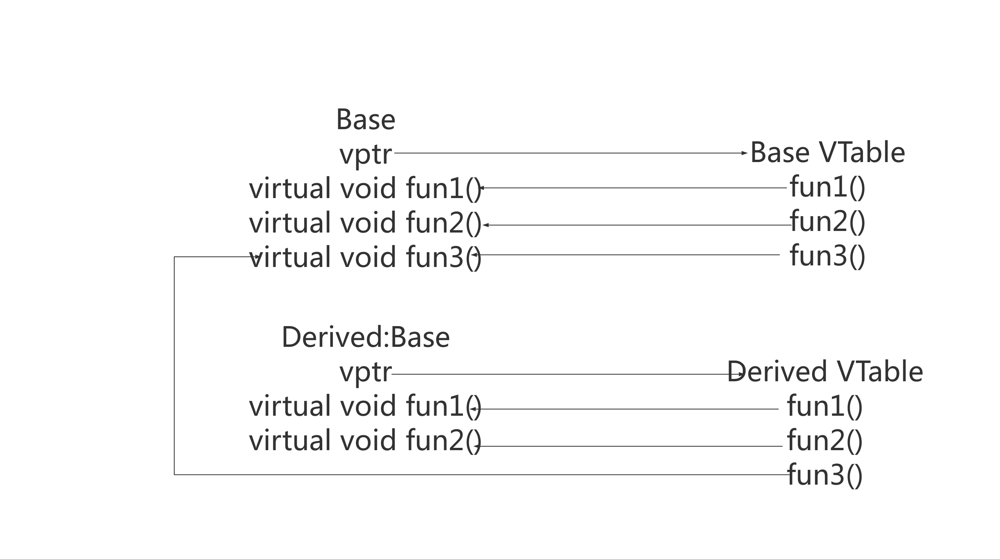

# 深入浅出C++虚函数的vptr与vtable

## 关于作者：

个人公众号：


## 1.基础理论

为了实现虚函数，C ++使用一种称为虚拟表的特殊形式的后期绑定。该虚拟表是用于解决在动态/后期绑定方式的函数调用函数的查找表。虚拟表有时会使用其他名称，例如“vtable”，“虚函数表”，“虚方法表”或“调度表”。

虚拟表实际上非常简单，虽然用文字描述有点复杂。首先，**每个使用虚函数的类（或者从使用虚函数的类派生）都有自己的虚拟表**。该表只是编译器在编译时设置的静态数组。虚拟表包含可由类的对象调用的每个虚函数的一个条目。此表中的每个条目只是一个函数指针，指向该类可访问的派生函数。

其次，编译器还会添加一个隐藏指向基类的指针，我们称之为vptr。vptr在创建类实例时自动设置，以便指向该类的虚拟表。与this指针不同，this指针实际上是编译器用来解析自引用的函数参数，vptr是一个真正的指针。

因此，它使每个类对象的分配大一个指针的大小。这也意味着vptr由派生类继承，这很重要。

## 2.实现与内部结构

下面我们来看自动与手动操纵vptr来获取地址与调用虚函数！

开始看代码之前，为了方便大家理解，这里给出调用图：



代码全部遵循标准的注释风格，相信大家看了就会明白，不明白的话，可以留言！

```c++
/**
 * @file vptr1.cpp
 * @brief C++虚函数vptr和vtable
 * 编译：g++ -g -o vptr vptr1.cpp -std=c++11
 * @author 光城
 * @version v1
 * @date 2019-07-20
 */

#include <iostream>
#include <stdio.h>
using namespace std;

/**
 * @brief 函数指针
 */
typedef void (*Fun)();

/**
 * @brief 基类
 */
class Base
{
    public:
        Base(){};
        virtual void fun1()
        {
            cout << "Base::fun1()" << endl;
        }
        virtual void fun2()
        {
            cout << "Base::fun2()" << endl;
        }
        virtual void fun3(){}
        ~Base(){};
};

/**
 * @brief 派生类
 */
class Derived: public Base
{
    public:
        Derived(){};
        void fun1()
        {
            cout << "Derived::fun1()" << endl;
        }
        void fun2()
        {
            cout << "DerivedClass::fun2()" << endl;
        }
        ~Derived(){};
};
/**
 * @brief 获取vptr地址与func地址,vptr指向的是一块内存，这块内存存放的是虚函数地址，这块内存就是我们所说的虚表
 *
 * @param obj
 * @param offset
 *
 * @return 
 */
Fun getAddr(void* obj,unsigned int offset)
{
    cout<<"======================="<<endl;
    void* vptr_addr = (void *)*(unsigned long *)obj;  //64位操作系统，占8字节，通过*(unsigned long *)obj取出前8字节，即vptr指针
    printf("vptr_addr:%p\n",vptr_addr);
    
    /**
     * @brief 通过vptr指针访问virtual table，因为虚表中每个元素(虚函数指针)在64位编译器下是8个字节，因此通过*(unsigned long *)vptr_addr取出前8字节，
     * 后面加上偏移量就是每个函数的地址！
     */
    void* func_addr = (void *)*((unsigned long *)vptr_addr+offset);
    printf("func_addr:%p\n",func_addr);
    return (Fun)func_addr;
}
int main(void)
{
    Base ptr;
    Derived d;
    Base *pt = new Derived(); // 基类指针指向派生类实例
    Base &pp = ptr; // 基类引用指向基类实例
    Base &p = d; // 基类引用指向派生类实例
    cout<<"基类对象直接调用"<<endl;
    ptr.fun1();
    cout<<"基类引用指向派生类实例"<<endl;
    pp.fun1(); 
    cout<<"基类指针指向派生类实例并调用虚函数"<<endl;
    pt->fun1();
    cout<<"基类引用指向基类实例并调用虚函数"<<endl;
    p.fun1();
    
    // 手动查找vptr 和 vtable
    Fun f1 = getAddr(pt, 0);
    (*f1)();
    Fun f2 = getAddr(pt, 1);
    (*f2)();
    delete pt;
    return 0;
}
```

运行结果：

```
基类对象直接调用
Base::fun1()
基类引用指向派生类实例
Base::fun1()
基类指针指向派生类实例并调用虚函数
Derived::fun1()
基类引用指向基类实例并调用虚函数
Derived::fun1()
=======================
vptr_addr:0x401130
func_addr:0x400ea8
Derived::fun1()
=======================
vptr_addr:0x401130
func_addr:0x400ed4
DerivedClass::fun2()
```

我们发现C++的动态多态性是通过虚函数来实现的。简单的说，通过virtual函数，指向子类的基类指针可以调用子类的函数。例如，上述通过基类指针指向派生类实例，并调用虚函数，将上述代码简化为：

```c++
Base *pt = new Derived(); // 基类指针指向派生类实例
cout<<"基类指针指向派生类实例并调用虚函数"<<endl;
pt->fun1();
```

其过程为：首先程序识别出fun1()是个虚函数，其次程序使用pt->vptr来获取Derived的虚拟表。第三，它查找Derived虚拟表中调用哪个版本的fun1()。这里就可以发现调用的是Derived::fun1()。因此pt->fun1()被解析为Derived::fun1()!

除此之外，上述代码大家会看到，也包含了手动获取vptr地址，并调用vtable中的函数，那么我们一起来验证一下上述的地址与真正在自动调用vtable中的虚函数，比如上述`pt->fun1()`的时候，是否一致！

这里采用gdb调试，在编译的时候记得加上`-g`。

通过`gdb vptr`进入gdb调试页面，然后输入`b Derived::fun1`对fun1打断点，然后通过输入r运行程序到断点处，此时我们需要查看调用栈中的内存地址，通过`disassemable fun1`可以查看当前有关fun1中的相关汇编代码，我们看到了`0x0000000000400ea8`，然后再对比上述的结果会发现与手动调用的fun1一致，fun2类似，以此证明代码正确!

gdb调试信息如下：

```c++
(gdb) b Derived::fun1
Breakpoint 1 at 0x400eb4: file vptr1.cpp, line 23.
(gdb) r
Starting program: /home/light/Program/CPlusPlusThings/virtual/pure_virtualAndabstract_class/vptr 
基类对象直接调用
Base::fun1()
基类引用指向派生类实例
Base::fun1()
基类指针指向派生类实例并调用虚函数

Breakpoint 1, Derived::fun1 (this=0x614c20) at vptr1.cpp:23
23	            cout << "Derived::fun1()" << endl;
(gdb) disassemble fun1
Dump of assembler code for function Derived::fun1():
   0x0000000000400ea8 <+0>:	push   %rbp
   0x0000000000400ea9 <+1>:	mov    %rsp,%rbp
   0x0000000000400eac <+4>:	sub    $0x10,%rsp
   0x0000000000400eb0 <+8>:	mov    %rdi,-0x8(%rbp)
=> 0x0000000000400eb4 <+12>:	mov    $0x401013,%esi
   0x0000000000400eb9 <+17>:	mov    $0x602100,%edi
   0x0000000000400ebe <+22>:	callq  0x4009d0 <_ZStlsISt11char_traitsIcEERSt13basic_ostreamIcT_ES5_PKc@plt>
   0x0000000000400ec3 <+27>:	mov    $0x400a00,%esi
   0x0000000000400ec8 <+32>:	mov    %rax,%rdi
   0x0000000000400ecb <+35>:	callq  0x4009f0 <_ZNSolsEPFRSoS_E@plt>
   0x0000000000400ed0 <+40>:	nop
   0x0000000000400ed1 <+41>:	leaveq 
   0x0000000000400ed2 <+42>:	retq   
End of assembler dump.
(gdb) disassemble fun2
Dump of assembler code for function Derived::fun2():
   0x0000000000400ed4 <+0>:	push   %rbp
   0x0000000000400ed5 <+1>:	mov    %rsp,%rbp
   0x0000000000400ed8 <+4>:	sub    $0x10,%rsp
   0x0000000000400edc <+8>:	mov    %rdi,-0x8(%rbp)
   0x0000000000400ee0 <+12>:	mov    $0x401023,%esi
   0x0000000000400ee5 <+17>:	mov    $0x602100,%edi
   0x0000000000400eea <+22>:	callq  0x4009d0 <_ZStlsISt11char_traitsIcEERSt13basic_ostreamIcT_ES5_PKc@plt>
   0x0000000000400eef <+27>:	mov    $0x400a00,%esi
   0x0000000000400ef4 <+32>:	mov    %rax,%rdi
   0x0000000000400ef7 <+35>:	callq  0x4009f0 <_ZNSolsEPFRSoS_E@plt>
   0x0000000000400efc <+40>:	nop
   0x0000000000400efd <+41>:	leaveq 
   0x0000000000400efe <+42>:	retq   
End of assembler dump.
```

